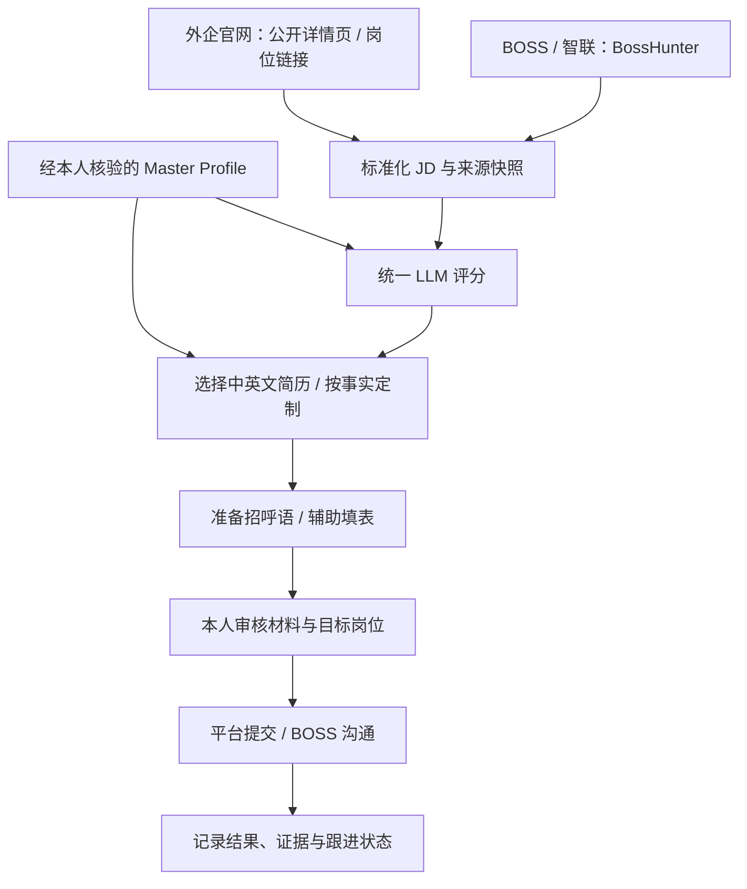

# JobPilot-CN

面向中国境内 AI 岗位的个人求职工作台，连接国内招聘平台与外企招聘官网。

**目标流程：BOSS + 智联 + 外企官网 → JD 采集 → LLM 评分 → 中英文简历选择/修改 → 自动填表 → 人工审核提交 → 投递记录。**

## 当前状态

2026-09-15：BossHunter 2.4.0 已在 Windows 安装运行，前端构建、Python 依赖检查、本地工作台、岗位查询接口及独立 Chrome 连接已通过验证。首批本地配置为上海、AI 应用 / Agent / RAG、DeepSeek。

2026-09-16 更新：已完成 BOSS 扩大验证，新增21条岗位，其中19条成功评分、2条因JD不足跳过。现有30条历史记录（含用户此前移除的4条），独立资格/JD质量检查、SQLite岗位池及人工审阅/申请记录已实现，19项测试通过。原始分数不能覆盖校招等资格问题。

本人重新登录 Chrome 后，扩大验证已完成，新增4条可人工评估岗位；其余待核实、低匹配或JD不足。当前岗位池入口为命令行和 Markdown 报告，未嵌入 BossHunter 页面，也未实现完整自动填表或投递。见 [使用说明](docs/job-pool.md) 和 [实现验收](docs/implementation-status-20260916.md)。

### 现在开始使用

1. 双击 [start-workbench.cmd](start-workbench.cmd)，打开本地配置页；在「AI 设置」填 Key 并保存，在「个人信息」上传本人简历。
2. 双击 [open-job-browser.cmd](open-job-browser.cmd)，在独立 Chrome 窗口登录 BOSS 和智联。
3. 完成后先做小样本单独采集和评分，暂不启动全流程或发送。

正在运行的工作台：[http://127.0.0.1:8686/config](http://127.0.0.1:8686/config)。运行记录和排错见 [本次部署验收](docs/deployment-status.md)。

| 组件 | 决策 | 已知边界 |
|---|---|---|
| [BossHunter](https://github.com/shengjidaguai-china/BossHunter) | 国内平台首选底座，独立运行 | BOSS 可审核后发送；智联只读采集与评分，投递手动完成；PolyForm 非商业许可 |
| [JobFill](https://github.com/Thesirloc/job-autofill) | 外企表单辅助评估工具 | Greenhouse / Lever / Workday；当前快照未找到 LICENSE，不将代码并入本仓库；未验证真实站点 |
| JobPilot-CN | 自建轻量整合层，待开发 | 统一数据、评分、简历版本、任务审核与投递台账 |

这两个项目不是现成互通的套件。共享 Profile、跨平台去重、统一评分及投递状态同步需要开发。

## 设计流程



## 文档入口

- [需求规格与原聊天纠偏](docs/requirements.md)
- [项目选型、源码证据与许可边界](docs/project-selection.md)
- [Windows 实际部署方案](docs/deployment-windows.md)
- [架构、数据契约与开发路线](docs/architecture-roadmap.md)
- [下载版本锁定记录](upstream.lock.json)
- [个人配置空白示例](config/profile.example.json)

## 本地目录

```text
求职agent/
├── 讨论.txt                    # 用户原始聊天，保留在仓库外
├── JobPilot-CN/                # 本仓库
└── upstream/
    ├── BossHunter/             # 原项目独立克隆
    └── job-autofill/           # 原项目独立克隆，仅评估
```

上游代码不随本仓库提交。其他机器按 `upstream.lock.json` 中的 URL 与 commit 获取相同版本，部署步骤见文档。克隆项目不等于安装成功或平台适配已通过验收。

## MVP 优先级

1. 先得到可追溯的岗位池：BOSS、智联、外企官网各一条完整 JD。
2. 打通“真实履历 → 解释性评分 → 中英文简历包 → 台账”，用离线样本验收。
3. 接入外企表单辅助，在最终提交前展示待核对内容。
4. 小范围验证真实投递与结果回填，再扩展平台。

个人履历、API Key、Cookie、简历和投递截图仅保存在本地私有目录；仓库只保留示例。JD 和网页内容均作为不可信数据，不得改变代理的操作权限或履历事实。

## 第三方许可

BossHunter 是 source-available 项目，不能描述为无商业限制的开源底座。使用与分发需遵循其 [LICENSE](https://github.com/shengjidaguai-china/BossHunter/blob/059bbe9d5c5cc306040cbdf387ac0680c00a1449/LICENSE)。其他候选项目需按具体快照核查授权。本仓库暂不替第三方代码授予任何许可。
